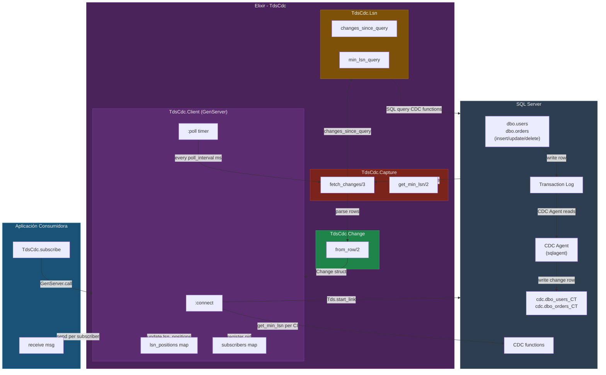

```mermaid
flowchart TB
    subgraph SQLServer["SQL Server"]
        direction TB
        UserTable["dbo.users\ndbo.orders\n(insert/update/delete)"]
        TxLog["Transaction Log"]
        CDCJob["CDC Agent\n(sqlagent)"]
        CDCTable["cdc.dbo_users_CT\ncdc.dbo_orders_CT"]
        CDCFn["CDC functions"]
    end

    UserTable -->|"write row"| TxLog
    TxLog -->|"CDC Agent reads"| CDCJob
    CDCJob -->|"write change row"| CDCTable

    subgraph TdsCdc["Elixir - TdsCdc"]
        direction TB

        subgraph Client["TdsCdc.Client (GenServer)"]
            direction TB
            Init[":connect"]
            Poll[":poll timer"]
            LsnTracker["lsn_positions map"]
            Subs["subscribers map"]
        end

        subgraph Capture["TdsCdc.Capture"]
            FetchChanges["fetch_changes/3"]
            GetMinLsn["get_min_lsn/2"]
        end

        subgraph Lsn["TdsCdc.Lsn"]
            ChangesQuery["changes_since_query"]
            MinLsnQuery["min_lsn_query"]
        end

        subgraph Change["TdsCdc.Change"]
            FromRow["from_row/2"]
        end
    end

    subgraph App["Aplicación Consumidora"]
        Subscribe["TdsCdc.subscribe"]
        ReceiveMsg["receive msg"]
    end

    Init -->|"Tds.start_link"| SQLServer
    Init -->|"get_min_lsn per CI"| CDCFn

    Poll -->|"every poll_interval ms"| FetchChanges
    FetchChanges -->|"changes_since_query"| Lsn
    Lsn -->|"SQL query CDC functions"| SQLServer
    SQLServer -->|"rows from CDC table"| FetchChanges
    FetchChanges -->|"parse rows"| FromRow
    FromRow -->|"Change struct"| Client

    Client -->|"update lsn_positions"| LsnTracker
    Client -->|"send per subscriber"| ReceiveMsg

    Subscribe -->|"GenServer.call"| Client
    Client -->|"register pid"| Subs

    style SQLServer fill:#2c3e50,color:#ecf0f1,stroke:#34495e
    style TdsCdc fill:#4a235a,color:#f5eef8,stroke:#6c3483
    style App fill:#1a5276,color:#eaf2f8,stroke:#2471a3
    style Client fill:#5b2c6f,color:#f4ecf7,stroke:#7d3c98
    style Capture fill:#7b241c,color:#fdedec,stroke:#b03a2e
    style Lsn fill:#7e5109,color:#fef9e7,stroke:#9a7d0a
    style Change fill:#1e8449,color:#eafaf1,stroke:#27ae60
```