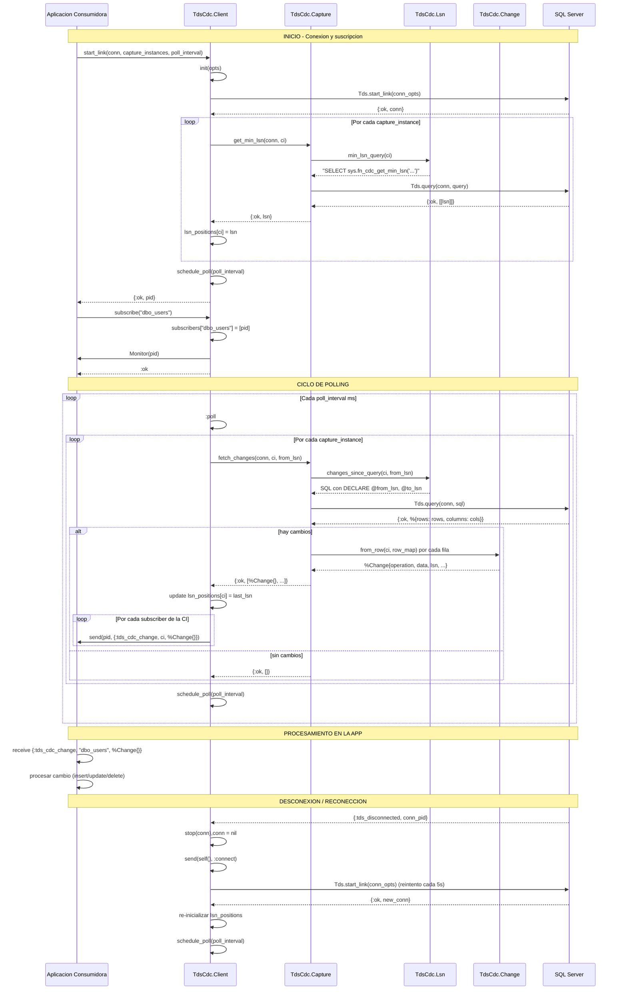

```mermaid
sequenceDiagram
    participant App as Aplicacion Consumidora
    participant Client as TdsCdc.Client
    participant Capture as TdsCdc.Capture
    participant Lsn as TdsCdc.Lsn
    participant Change as TdsCdc.Change
    participant SQL as SQL Server

    Note over App,SQL: INICIO - Conexion y suscripcion

    App->>Client: start_link(conn, capture_instances, poll_interval)
    Client->>Client: init(opts)
    Client->>SQL: Tds.start_link(conn_opts)
    SQL-->>Client: {:ok, conn}

    loop Por cada capture_instance
        Client->>Capture: get_min_lsn(conn, ci)
        Capture->>Lsn: min_lsn_query(ci)
        Lsn-->>Capture: "SELECT sys.fn_cdc_get_min_lsn('...')"
        Capture->>SQL: Tds.query(conn, query)
        SQL-->>Capture: {:ok, [[lsn]]}
        Capture-->>Client: {:ok, lsn}
        Client->>Client: lsn_positions[ci] = lsn
    end

    Client->>Client: schedule_poll(poll_interval)
    Client-->>App: {:ok, pid}

    App->>Client: subscribe("dbo_users")
    Client->>Client: subscribers["dbo_users"] = [pid]
    Client->>App: Monitor(pid)
    Client-->>App: :ok

    Note over App,SQL: CICLO DE POLLING

    loop Cada poll_interval ms
        Client->>Client: :poll

        loop Por cada capture_instance
            Client->>Capture: fetch_changes(conn, ci, from_lsn)
            Capture->>Lsn: changes_since_query(ci, from_lsn)
            Lsn-->>Capture: SQL con DECLARE @from_lsn, @to_lsn
            Capture->>SQL: Tds.query(conn, sql)
            SQL-->>Capture: {:ok, %{rows: rows, columns: cols}}

            alt hay cambios
                Capture->>Change: from_row(ci, row_map) por cada fila
                Change-->>Capture: %Change{operation, data, lsn, ...}
                Capture-->>Client: {:ok, [%Change{}, ...]}

                Client->>Client: update lsn_positions[ci] = last_lsn

                loop Por cada subscriber de la CI
                    Client->>App: send(pid, {:tds_cdc_change, ci, %Change{}})
                end
            else sin cambios
                Capture-->>Client: {:ok, []}
            end
        end

        Client->>Client: schedule_poll(poll_interval)
    end

    Note over App,SQL: PROCESAMIENTO EN LA APP

    App->>App: receive {:tds_cdc_change, "dbo_users", %Change{}}
    App->>App: procesar cambio (insert/update/delete)

    Note over App,SQL: DESCONEXION / RECONECCION

    SQL-->>Client: {:tds_disconnected, conn_pid}
    Client->>Client: stop(conn),conn = nil
    Client->>Client: send(self(), :connect)
    Client->>SQL: Tds.start_link(conn_opts) (reintento cada 5s)
    SQL-->>Client: {:ok, new_conn}
    Client->>Client: re-inicializar lsn_positions
    Client->>Client: schedule_poll(poll_interval)
```